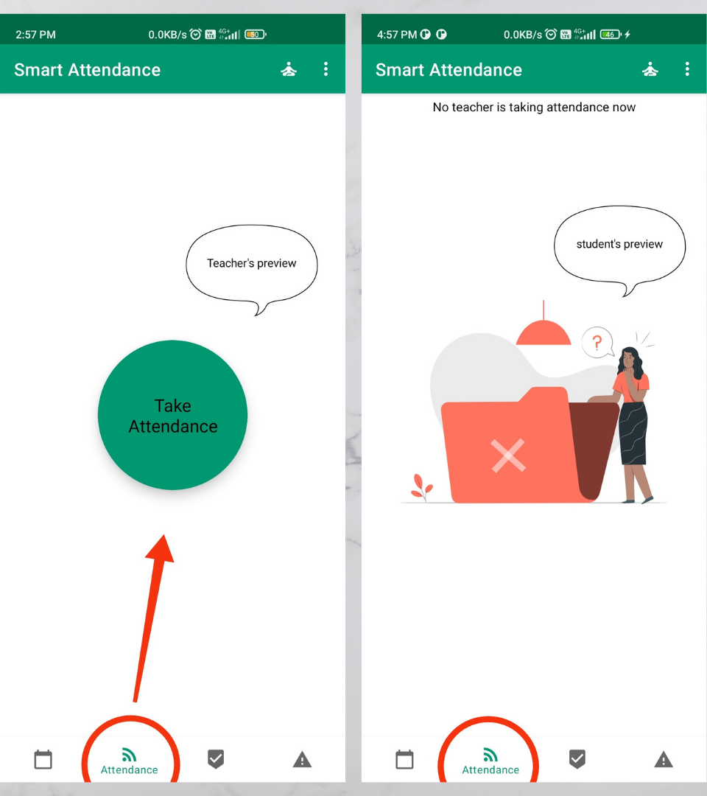

# Smart Attendance app
#### Introduction
It is new and efficient way of talking attendance at end of every lecture in college.
It has a clean and elegant UI which is user-friendly.
# Core Objective
- To deliver the authentic experience to user.
- To alter the traditional method by morden technology.

# Overall Features
### Attendance Session 
If teacher is logged in then under attendance tab he/she gets a button to take attendance of student. When the button is clicked by teacher the attendance session start.

If student is logged in and attendance session is not started then under attendance tab he/she can't see give attendance button.

only techer's can start attendance session.  Attendance session is divided in three stages (each stage of 10 second).
###### stages
at these stage (give attendance) button is visible at student's end for 10 second. Those student which are present in class knows it and they click button.
after that, stage 2 begine automatically. at these stage student has to choose one correct number out of four which is tell to them by teacher and in last stage they have to choose correct letter which is also told to them by teacher. Those student who clear all the stages are marked as present.

