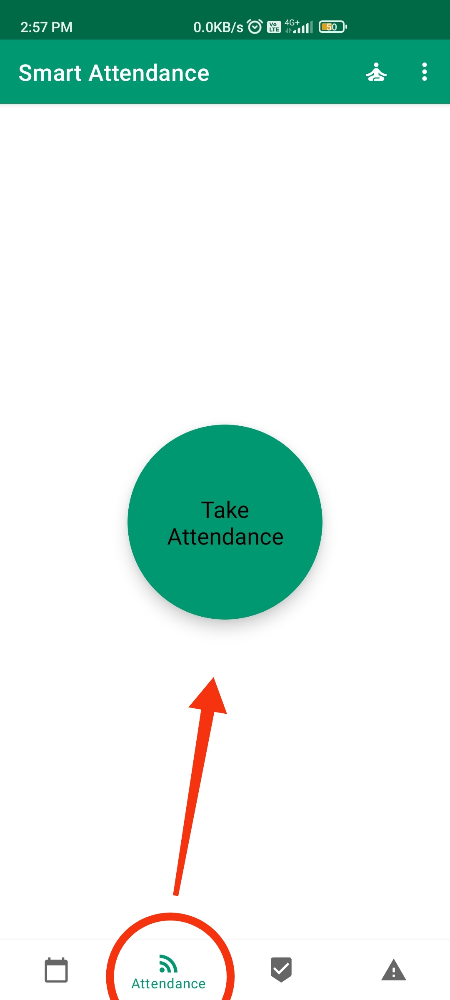
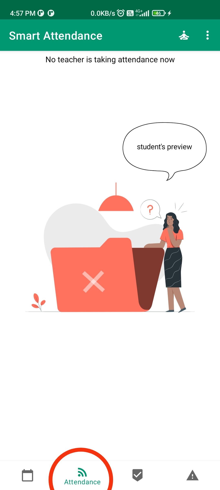

# Smart Attendance app
#### Introduction
It is new and efficient way of talking attendance at end of every lecture in college.
It has a clean and elegant UI which is user-friendly.
# Core Objective
- To deliver the authentic experience to user.
- To alter the traditional method by morden technology.

# Overall Features
### Attendance Session 
If teacher is logged in then under attendance tab he/she gets an button to take attendance of student. When the button is pressed by teacher the attendance session start.
Attendance session is divided in three stage (each stage of 30 second).

If student is logged and attendance session is not started then under attendance tab he/she can't see give attendance button.

